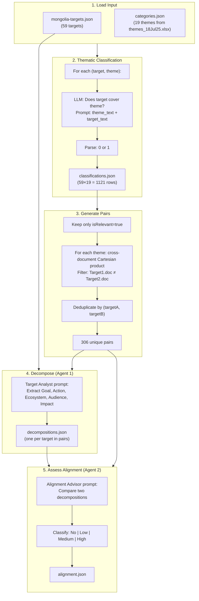

# Pipeline Walkthrough: Step-by-Step with Example

## Example: NBT 7 vs NDC Animal husbandry and pastureland 4

**Original report:** No alignment  
**Our pipeline:** Medium alignment  

This pair illustrates where the two pipelines diverge.

---

## Step 1: Load Input Data

**Inputs:**
- `mongolia-targets.json` — 59 targets from NAP (15), NDC (25), NBSAP (19)
- `categories.json` — 19 themes from `themes_18Jul25.xlsx`

**Our example targets:**

| ID | Document | Text |
|----|----------|------|
| NBT_7 | NBSAP | "Develop highly productive and sustainable forestry and agricultural production through the adoption of environmentally friendly practices" |
| NDC_AnimalHusbandry_4 | NDC | "Establish sustainable and rational collaborative management practices for pastures and expand the scope of pasture restoration." |

---

## Step 2: Thematic Classification

For each **(target, theme)** pair, the LLM returns 0 or 1: does the target cover this theme?

**Prompt structure:**
- System: Policy specialist persona + 19 theme names
- User: `"Here are the cross-reference theme texts: {theme_name} {theme_description}. Here is the target texts: {target_text}. Assess whether or not the target texts cover the topics of the cross-reference theme texts."`
- Response: `0` or `1`

**Results for our example:**

| Target | Themes matched (isRelevant=true) |
|--------|----------------------------------|
| NBT_7 | theme_1 (Agriculture), theme_3 (Forest), theme_7 (Soil), theme_9 (Value chain), theme_10 (Carbon), theme_11 (Climate), theme_14 (AFOLU), theme_15 (Pollution), theme_18 (SDGs) |
| NDC_AnimalHusbandry_4 | theme_1 (Agriculture), theme_5 (Grassland) |

**Shared theme:** theme_1 (Agriculture and livestock management) — both targets are classified as relevant.

---

## Step 3: Generate Pairs

Pairs are created only when two targets from different documents share at least one theme.

**Logic:**
1. For each theme, collect targets with `isRelevant=true`
2. For each pair of document types (NBSAP×NDC, NBSAP×NAP, NDC×NAP), take the Cartesian product of targets in that theme
3. Deduplicate by target pair (same pair can share multiple themes)

**For (NBT_7, NDC_AnimalHusbandry_4):**
- Both are in theme_1 (Agriculture)
- NBT_7 is NBSAP, NDC_AnimalHusbandry_4 is NDC → different document types
- Pair is included → 1 of 306 pairs

---

## Step 4: Decompose Targets (Agent 1 – Target Analyst)

Each target is decomposed into five structured fields.

**Prompt:** Extract Goal/Purpose, Action/Intervention, Ecosystem/Area, Target Audience, Expected Impact/Outcome.

**Decompositions for our example:**

**NBT_7:**
```json
{
  "Goal/Purpose": "Develop highly productive and sustainable forestry and agricultural production",
  "Action/Intervention": "Adoption of environmentally friendly practices",
  "Ecosystem/Area": "Forestry and agriculture",
  "Target Audience": "Farmers, forestry managers, agricultural producers",
  "Expected Impact/Outcome": "Increased productivity and sustainability in forestry and agricultural sectors"
}
```

**NDC_AnimalHusbandry_4:**
```json
{
  "Goal/Purpose": "Establish sustainable and rational collaborative management practices for pastures and expand the scope of pasture restoration.",
  "Action/Intervention": "Implement collaborative management practices and expand pasture restoration efforts.",
  "Ecosystem/Area": "Pastures and grassland ecosystems.",
  "Target Audience": "Land managers, farmers, and stakeholders involved in pasture management.",
  "Expected Impact/Outcome": "Improved sustainability of pasture management and increased area of restored pastures."
}
```

---

## Step 5: Assess Alignment (Agent 2 – Alignment Advisor)

**Input:** Only the decomposition strings (no raw target text).

**Prompt:** Compare the two decompositions and assign one of:
- No alignment
- Low alignment
- Medium alignment
- High alignment

**Our pipeline output for this pair:**
> **Medium alignment** — "The targets share a common goal of promoting sustainability in agricultural practices, with both addressing the needs of farmers and land managers. While they focus on different ecosystems—forestry and agriculture versus pastures—they could benefit from coordinated efforts in sustainable land management practices, enhancing overall productivity and environmental health."

**Original report output:**
> **No alignment** — (Report states this pair explicitly as a No alignment example in Figure 3.5.)

---

## Why the Difference?

| Factor | Original (Azure GPT-4o-mini) | Ours (OpenRouter GPT-4o-mini) |
|--------|-----------------------------|-------------------------------|
| **Input to Alignment Advisor** | Decomposition only | Decomposition only (now matched) |
| **Decomposition content** | May differ (different model run) | "Forestry and agriculture" vs "Pastures and grassland" |
| **Model behaviour** | More conservative → No alignment | Sees shared "sustainability", "farmers", "land management" → Medium |
| **Strictness** | "Forestry+agriculture" vs "Pastures" → distinct → No | "Agricultural practices" overlap → Medium |

The original model treats forestry/agriculture and pastures as distinct ecosystems and chooses No alignment. Our model emphasises shared sustainability and land management and chooses Medium. Both use the same prompts; the difference comes from model behaviour.

---

## Pipeline Diagram



---

## Simplified Data Flow

```
mongolia-targets.json ──┐
                        ├──► [Step 2] 59×19 classification calls ──► classifications.json
categories.json ────────┘
                                    │
                                    ▼
                        [Step 3] Shared-theme pairs ──► 306 pairs
                                    │
                                    ▼
                        [Step 4] Decompose each target in pairs ──► decompositions.json
                                    │
                                    ▼
                        [Step 5] Compare each pair's decompositions ──► alignment.json
```

---

## Key Decision Points

1. **Classification:** LLM returns 0/1. Parsing uses `startswith("1")` or `startswith("0")` plus fallbacks for "yes"/"pertains".
2. **Pair formation:** A pair is created only if both targets share at least one theme with `isRelevant=true`.
3. **Alignment:** Only decomposition strings are passed to the Alignment Advisor; the Advisor assigns one of four levels based on goal, action, ecosystem, audience, and impact overlap.
