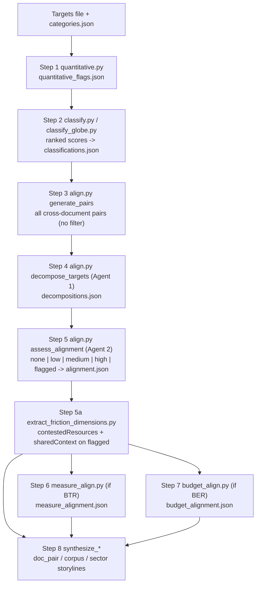

# Pipeline Walkthrough: One Analysis Run, Step by Step

This traces a single coherence analysis from policy targets to dashboard-ready
JSON, against the live code in `python/src/`. It is the "how it runs" companion
to [`../METHODOLOGY.md`](../METHODOLOGY.md), which explains the "why". For the
document → targets extraction phase that produces the input, see
[`EXTRACTION_PIPELINE.md`](EXTRACTION_PIPELINE.md).

*Last verified against the pipeline (`python/src/`) at commit `8cdb1ff` on 2026-06-19; updated 2026-06-29 to add the GGA climate-resilience taxonomy (decision 2/CMA.5). Re-verify and bump this stamp whenever pipeline behaviour changes; see [`../PROJECT_GUIDELINES.md`](../PROJECT_GUIDELINES.md).*

The whole run is orchestrated by **`run_analysis.py`** as eight stages (`TOTAL_STEPS = 8`). Steps 6 and 7 run only when the relevant data exists. Every LLM call is cached on disk by a hash of `{system_prompt, user_prompt, model}`, namespaced per step, so re-running with the same inputs and model costs nothing.

## How to run

```bash
cd python
uv venv && source .venv/bin/activate
uv pip install -e ".[dev]"

python -m src.run_analysis                                   # default: Mongolia
python -m src.run_analysis --targets-file panama-targets.json
python -m src.run_analysis --language mn                     # en | es | mn | fr
```

`--targets-file` selects the country (`mongolia` / `panama` / `sri-lanka`); output lands in `python/output/{country}/`. `--language` threads an output language through the LLM prompts and uses a separate cache namespace.

## Running example

We follow two Mongolia targets through the run. Mongolia has **153 targets** across seven document types (FSS 41, NDC 27, NRVTS 27, NBSAP 20, NAP 15, Vision 2050 / SECTORAL 15, ILDN 8).

| ID | Document | Text (abridged) |
|----|----------|-----------------|
| `FSS_1` | Food Security Strategy | "Draft legislation establishing a legal framework for ensuring food supply and safety ... increase export-oriented food and agricultural products." |
| `ILDN_3` | Land Degradation Neutrality | "Catalyze the strategic expansion of Mongolia's protected areas system through a network of managed resource protected areas in under-represented ecosystems." |

---

## Step 1: Quantitative & Time-Bound Detection

- **Script:** `quantitative.py` · **Cache:** `quantitative_flags`
- **Reads:** the targets file · **Writes:** `quantitative_flags.json`

An LLM flags each target for measurable values (`isQuantitative`) and explicit time horizons (`isTimeBound`). Targets are batched 12 per call (`BATCH_SIZE = 12`).

---

## Step 2: Thematic Classification

- **Script:** `classify.py` (`rank_classification`), `classify_globe.py` for GLOBE · **Cache:** `rank_{taxonomy}`
- **Reads:** targets + `data/categories.json` (+ optional adaptation goals) · **Writes:** `classifications.json`

For each target the **ranked** classifier scores every category in a taxonomy (0.0–1.0). Each record carries `score`, `isRelevant` (`score >= 0.5`), `isPrimary` (top score), and `taxonomyType`. Taxonomies: NBS (10), IPCC sectors (7), GLOBE categories (9) + subcategories (49), GGA climate-resilience themes (7), and optional country adaptation goals. GLOBE uses BIOFIN expert few-shot examples when a country provides them. The GGA themes are the seven thematic targets of the UAE Framework for Global Climate Resilience (decision 2/CMA.5, para. 9), applied as a portable adaptation/resilience lens. Classification feeds dashboard grouping (lenses); it is **not** a pairing filter.

---

## Step 3: Generate Cross-Document Pairs

- **Script:** `align.py` (`generate_pairs`) · computation, no LLM

Every target is paired with every target from a **different** document type (Cartesian product across doc types, deduplicated by id-sorted pair). No classification filter is applied. For Mongolia this yields **9,678** pairs to assess. `FSS_1` (FSS) and `ILDN_3` (ILDN) are different document types, so the pair is included.

---

## Step 4: Decompose Targets — Agent 1 (Target Analyst)

- **Script:** `align.py` (`decompose_targets`) · **Cache:** `decompose`
- **Writes:** `decompositions.json`

Each target is broken into five fields so alignment is judged on policy content, not keywords: Goal/Purpose, Action/Intervention, Ecosystem/Area, Target Audience, Expected Impact/Outcome. The agent stays factual (no inference beyond the target text).

Decomposition for `FSS_1` (abridged):

```json
{
  "Goal/Purpose": "Establish a legal framework for ensuring food supply and safety, reduce reliance on imported food, and increase export-oriented food and agricultural products.",
  "Action/Intervention": "Draft legislation and submit it to the State Great Khural ...",
  "Ecosystem/Area": "Food and agricultural production; legal/regulatory environment",
  "...": "..."
}
```

---

## Step 5: Assess Alignment — Agent 2 (Alignment Advisor)

- **Script:** `align.py` (`assess_alignment`), schema in `alignment_schema.py` · **Cache:** `alignment_v2`
- **Reads:** the two decompositions (never the raw target text) · **Writes:** `alignment.json`

The advisor assigns one of **five states** (v2.1 schema): `none`, `low`, `medium`, `high`, or `flagged`. A `flagged` pair (display label "Potential misalignment") additionally carries `mechanism` (`goal_conflict` / `resource_competition` / `delivery_friction`), `manageability` (`manageable` / `fundamental`), and `confidence` (`high` / `medium` / `low`). Earlier labels (`possible conflict`, `likely conflict`, `low_tension`, ...) parse only as backward-compatible aliases collapsing onto `flagged`.

Real output for `FSS_1` × `ILDN_3`:

```json
{
  "targetAId": "FSS_1",
  "targetBId": "ILDN_3",
  "alignment": "flagged",
  "mechanism": "delivery_friction",
  "manageability": "manageable",
  "confidence": "medium",
  "description": "The food-security target seeks to build a legal environment for expanding export-oriented agriculture ... while the LDN target seeks to expand a network of managed resource protected areas. These targets share land-use relevance ... but agricultural legal expansion may create implementation pressure on some of the same landscapes the protected-area network aims to conserve, so coordination through zoning and safeguards would be needed."
}
```

A positive verdict looks the same minus the three sub-fields, e.g. `FSS_17` × `ILDN_4` → `high` (soil-protection measures directly support land-degradation-neutrality outcomes). Across Mongolia's 9,678 pairs the spread is roughly medium 5,691 · low 1,512 · high 1,336 · flagged 1,128 · none 11.

### Step 5a: Friction-Dimension Enrichment

- **Script:** `extract_friction_dimensions.py` · **Cache:** `friction_dimensions`

A separate cached pass reads the rationale of `flagged` pairs whose mechanism is `resource_competition` or `delivery_friction` and, grounded strictly in that text, adds `contestedResources` (≤3 common nouns) and `sharedContext` (a place name) in place. For our pair it adds `"contestedResources": ["landscape"]`. Running it separately keeps verdicts stable across re-runs.

---

## Step 6: BTR Measure Alignment — Level 3 (conditional)

- **Script:** `measure_align.py` · **Writes:** `measure_alignment.json`, `measure_pseudo_targets.json`
- **Runs when:** BTR data (`btr_data.json`) is present

BTR mitigation measures and, where available, adaptation actions become pseudo-targets, are paired with every policy target, decomposed by Agent 1, and assessed by an adapted Agent 2 on the same five-state scale (reported side is called "the action"; adaptation actions are not penalised for missing CO2e figures). Mitigation×adaptation cross-pairs are assessed when both sets exist.

---

## Step 7: Budget Alignment — Level 2 (conditional)

- **Script:** `budget_align.py` · **Writes:** `budget_alignment.json`, `budget_pseudo_targets.json`
- **Runs when:** a Biodiversity Expenditure Review (`{country}-ber.json`) is present (Mongolia)

Budget programmes (name, description, multi-year expenditure) become pseudo-targets and are aligned against each policy target on the same five-state scale, surfacing where reviewed biodiversity spending matches policy ambition.

---

## Step 8: Synthesis Layer

- **Scripts:** `synthesize_doc_pairs.py`, `synthesize_corpus.py`, `synthesize_by_sector.py`, states by `synthesis_states.py`
- **Writes:** `doc_pair_synthesis.json`, `corpus_themes.json`, `sector_synthesis.json` (+ `.{lang}.json` variants)

Three LLM passes turn the pairwise verdicts into short, hedged storylines: per document-pair, country-wide (corpus), and per sector within each lens. Coordination hints are process pointers only and always hedged. Syntheses are pre-computed for every document include/exclude state the dashboard filter can reach, so nothing runs at view time.

---

## Output files (`python/output/{country}/`)

| File | Step | Always? |
|------|------|---------|
| `quantitative_flags.json` | 1 | yes |
| `classifications.json` | 2 | yes |
| `decompositions.json` | 4 | yes |
| `alignment.json` | 5 + 5a | yes |
| `doc_pair_synthesis.json`, `corpus_themes.json`, `sector_synthesis.json` | 8 | yes |
| `measure_alignment.json`, `measure_pseudo_targets.json` | 6 | if BTR data |
| `budget_alignment.json`, `budget_pseudo_targets.json` | 7 | if BER data |
| `status.json`, `footprint.json` | all | yes (progress + footprint) |

---

## Pipeline diagram



---

## Key points

1. **Classification is grouping-only.** It never gates which pairs are assessed; all cross-document pairs go to Agent 2.
2. **Two agents.** Decomposition (Agent 1) and alignment (Agent 2) are separated so verdicts rest on structured content; the same two-agent flow is reused for BTR (Step 6) and budget (Step 7).
3. **Negative side is one state.** `flagged` with `mechanism` / `manageability` / `confidence`, not a graded severity scale. It is shown as "Potential misalignment"; "tension"/"contradiction" wording appears only as legacy parser aliases.
4. **Caching is per step and per language.** Identical inputs and model recompute nothing; a cold-run canary warns when the cache will recompute at full cost.
